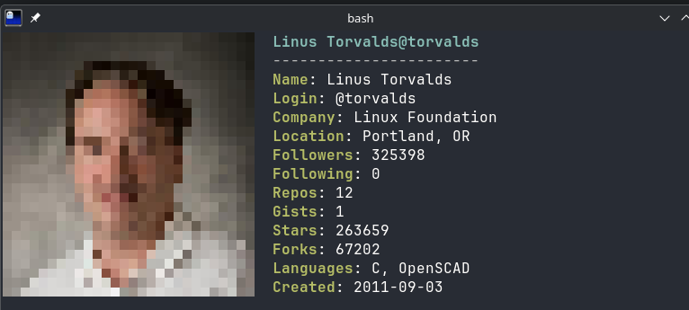

# gitfetcher

Neofetch for your GitHub profile. Run it, get your avatar and stats side by side in the terminal.



## Setup

You need [uv](https://docs.astral.sh/uv/). Then:

```bash
uv sync
```

## Use

```bash
uv run gitfetcher torvalds
uv run gitfetcher octocat --width 24
```

That's it. The image backend is picked automatically: real inline images on Kitty, iTerm2 and WezTerm, colored block art everywhere else. If you want to force one:

```bash
uv run gitfetcher torvalds --image kitty
uv run gitfetcher torvalds --image ascii
uv run gitfetcher torvalds --image none
```

Full options (`--width`, `--no-stats`, `--token`, `--version`):

```bash
uv run gitfetcher --help
```

## GitHub rate limits

Unauthenticated API calls are capped at 60/hour per IP. If you hit that, make a token (no scopes needed) and either pass `--token` or export `GITHUB_TOKEN`. Repo stats (stars, forks, languages) take one extra API call; skip it with `--no-stats`.

## Notes

- Works over SSH as long as your local terminal speaks the image protocol (Kitty graphics pass through tmux with `allow-passthrough on`).
- Piped output falls back to plain text, no escape garbage.
